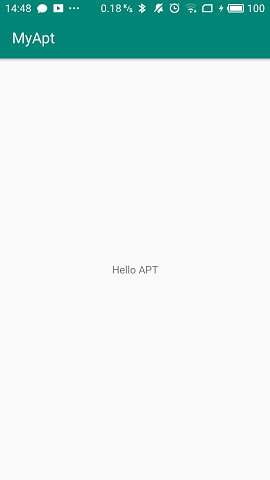

# Android 高级技术 APT 入门
## 什么是APT?
__APT__(Annotation Processing Tool)注解处理工具，它是jdk提供的一套工具，通过这套工具我们可以在编译时，根据注解自动生成Java代码，如果你用过dagger,bindview，GreenDao等开源库那么相信你对这套东西会有一定了解。
## APT的适用场景
通过少量的注解生成大量重复的代码，从而减少工作量，而且可以避免犯错。
## APT入门
接下来我们先写一个小demo:通过在编译时同过自定义注解`@Test`自动生成一个类`APTTest`,该类提供一个`getString()`方法，返回一个字符串`Hello APT`。   

1. 新建两个Java Library,注意必须是Java Library，Android Library不提供需要的支持类  
    
      
    其中lib_annotation用来提供注解，lib_compiler用来生成代码

2. 在lib_annotation下，编写注解：  
    ``` Java
    package com.sunchenhao.lib_annotation;

    import java.lang.annotation.ElementType;
    import java.lang.annotation.Retention;
    import java.lang.annotation.RetentionPolicy;
    import java.lang.annotation.Target;

    /**
     * @description:
     * @author:孙晨昊
     * @date: 2020/1/5
     **/
    @Target(ElementType.TYPE)
    @Retention(RetentionPolicy.SOURCE)
    public @interface Test {
    }
    ```
3. 给app和lib_compiler添加依赖（基于`gradle:3.5.3`,老版本可能会有不同）：
    ```groovy
      //app
      dependencies {
          implementation project(path: ':lib_annotation')
          annotationProcessor project(path: ':lib_compiler')
      }

      //:lib_compiler
      dependencies {
          compileOnly 'com.google.auto.service:auto-service:1.0-rc6'
          implementation 'com.squareup:javapoet:1.11.1'
          annotationProcessor 'com.google.auto.service:auto-service:1.0-rc6'
          implementation project(path: ':lib_annotation')
      }
    ```
4. 在lib_compiler下编写processer
    ```Java
    package com.sunchenhao.lib_compiler;

    import com.google.auto.service.AutoService;
    import com.squareup.javapoet.JavaFile;
    import com.squareup.javapoet.MethodSpec;
    import com.squareup.javapoet.TypeSpec;

    import java.io.IOException;
    import java.util.Set;

    import javax.annotation.processing.AbstractProcessor;
    import javax.annotation.processing.Processor;
    import javax.annotation.processing.RoundEnvironment;
    import javax.annotation.processing.SupportedAnnotationTypes;
    import javax.annotation.processing.SupportedSourceVersion;
    import javax.lang.model.SourceVersion;
    import javax.lang.model.element.Modifier;
    import javax.lang.model.element.TypeElement;

    /**
     * @description:
     * @author:孙晨昊
     * @date: 2020/1/5
     **/
    @AutoService(Processor.class) //表明这个类是一个processor
    @SupportedAnnotationTypes({"com.sunchenhao.lib_annotation.Test"})//声明需要匹配的注解
    @SupportedSourceVersion(SourceVersion.RELEASE_8)//支持的Java版本
    public class TestProcessor extends AbstractProcessor {

        @Override
        public boolean process(Set<? extends TypeElement> set, RoundEnvironment roundEnvironment) {
            //新建一个方法
            MethodSpec getString = MethodSpec.methodBuilder("getString")
                    .addModifiers(Modifier.PUBLIC)
                    .returns(String.class)
                    .addCode("return \"Hello APT\";\n")
                    .build();
            //新建一个类
            TypeSpec testType = TypeSpec.classBuilder("APTTest").addModifiers(Modifier.PUBLIC).addMethod(getString).build();

            //生成这个类
            JavaFile javaFile = JavaFile.builder("com.sunchenhao.myapt", testType)
                    .build();
            try {
                javaFile.writeTo(processingEnv.getFiler());
            } catch (IOException e) {
                e.printStackTrace();
                System.out.println(e);
            }
            return true;
        }
    }
    ```
5. 在app下新建接口`ITest`声明注解为`@Test`:
    ```Java
    package com.sunchenhao.myapt;

    import com.sunchenhao.lib_annotation.Test;

    /**
     * @description:
     * @author: 孙晨昊
     * @date: 2020/1/5
     **/
    @Test
    public interface ITest {
    }
    ```
6. 按下Ctrl+F9,编译完成后在app->build->generated->ap_generated_sources目录下就可以找到我们生成的类。接下来我们就可以在我们的项目中使用这个类。
    ```Xml
    <?xml version="1.0" encoding="utf-8"?>
    <androidx.constraintlayout.widget.ConstraintLayout xmlns:android="http://schemas.android.com/apk/res/android"
        xmlns:app="http://schemas.android.com/apk/res-auto"
        xmlns:tools="http://schemas.android.com/tools"
        android:layout_width="match_parent"
        android:layout_height="match_parent"
        tools:context=".MainActivity">

        <TextView
            android:id="@+id/test"
            android:layout_width="wrap_content"
            android:layout_height="wrap_content"
            android:text="Hello World!"
            app:layout_constraintBottom_toBottomOf="parent"
            app:layout_constraintLeft_toLeftOf="parent"
            app:layout_constraintRight_toRightOf="parent"
            app:layout_constraintTop_toTopOf="parent" />

    </androidx.constraintlayout.widget.ConstraintLayout>
    ```
    ```Java
    package com.sunchenhao.myapt;

    import androidx.appcompat.app.AppCompatActivity;

    import android.os.Bundle;
    import android.widget.TextView;

    public class MainActivity extends AppCompatActivity {

        @Override
        protected void onCreate(Bundle savedInstanceState) {
            super.onCreate(savedInstanceState);
            setContentView(R.layout.activity_main);
            ((TextView)findViewById(R.id.test)).setText(new APTTest().getString());
        }
    }    
    ```
7. 运行代码
      
## Demo
github:https://github.com/Charles199310/MyApt
