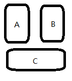

# APT应用实战——解决Arouter冷启动问题
我们公司的业务是面向非洲的（尼日利亚），黑叔叔的手机性能不敢恭维，在前一段时间，发生了很多ANR，经排查，和Arouter有很大的关系。  
由于Arouter采取类再App启动的时候加载路由表，导致在一些低性能手机上表现非常差。在华为畅享9（新手机）上大概需要几十毫秒。在一台用了一年的小米手机上花了几百毫秒，在传音手机上（黑叔叔常用的品牌）甚至需要两秒多。由于首次启动需要遍历所有的class文件，所以首次启动可能需要更长时间。严重的时候还会引起ANR。
Arouter的作用是跨模块启动Activity，调用Fragement。之所以会需要用Arouter本质上是因为我们在做组件化的时候会产生上下，或平行结构。  
  
如图，A模块不能调用B模块的对象，C模块不能调用A、B模块。这就导致了我们项目中跳转页面的不方便。  
为了解决这个问题，我们新建一个公共的最顶层，和一个最底层。最顶层可以获取对其他所有模块的依赖，而所有模块都可以调用最底层。我们可以从最顶层获取所有的Acivity的Class，然后注入到最底层，这样就可以不受限制的实现获取其他模块的Activity的class了。  
说了这么多，APT有什么关系呢？APT是我们的代码生成工具，可以通过代码来生成类。我们通过APT来生成我们的最顶成类。

首先我们先新建两个Java Labirary
