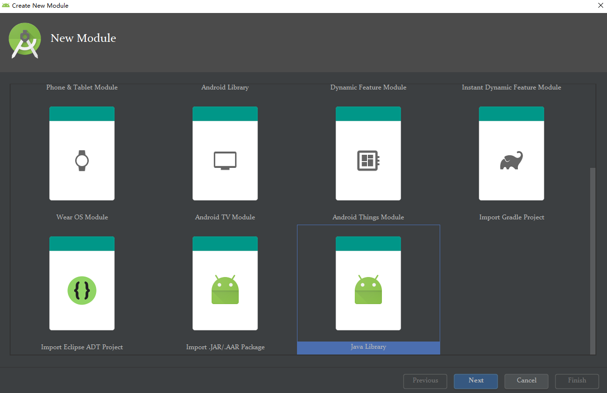
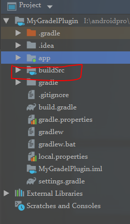
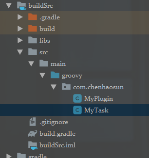

# 编写自定义Android Gradle Plugin  
## 什么是Gradle
Gradle是我们在Android工程中的 __自动构建工具__ 。__自动化构建__ 就是将我们的代码打包成jar、aar、apk的过程。  
我们知道，我们编写的Java、xml并不能直接运行在ART、Dalvik或者JVM上。需要将其编译为dex或jar、class，如可可能的话还要直接运行。Gradle将这些操作打包成一个命令。
在Java历史上有过Ant、Maven。发展到现在Gradle被认为集合了Ant和Maven的灵活和易用等优点，在这里不做论述。

## 自定义Gradle插件能做什么
利用Gradle，我们可以：  
1. 自动生成代码（Android R.java 以及GreedDao，Dagger等众多开元库就是这么做的）  
2. 代码或文件检查（lint就是这么做的）和抛出自定义编译时错误（有时候不方便用lint等工具检查）
3. 在打包的过程中做一些我们希望自动执行的事情，比如讲打包好的文件发到群里@相关人员等  

## Gradle插件如何编写
Gradle插件有三种编写，并应用的方法：  
1. 编写Gradle文件，在应用模块上用`apply from: ...`应用该文件。
2. 在project目录下，新建名为buildSrc的groovy模块，用`apply plugin: ...`应用该模块。
3. 新建groovy模块，打包成jar包，发布，用`classpath ...`引入jar包，用`apply plugin: ...`应用该jar包

第三种方式一般用于发布出来，但是在自己的项目中不方便debug,以及随时扩展，更适合在为其他项目服务。  
下面我们主要讲一下前两中方式：

### Gradle脚本插件

优点：编写灵活，适合简单的插件  

1. 编写脚本文件：  
  ``` Groovy
  class Myplugin implements Plugin<Project> {
      @Override
      void apply(Project target) {
          target.task('hello', group: 'util') {
              doLast {
                  logger.quiet("Hello Plugin.")
              }
          }
      }
  }
  // 需要在脚本中写这么一句，否则脚本不会运行
  apply plugin:Myplugin
  ```

2. 在需要应用plugin的模块的build.grale文件中添加脚本文件:  
  ``` Groovy  
  apply plugin: 'com.android.application'  
  //引入脚本文件  
  apply from: 'plugin.gradle'
  android {
    ……
  }
  dependencies {
    ……
  }
  ```  

### buildSrc插件

优点：适合复杂插件

1. 新建Java library名为buildSrc:  
  
  
2. 修改buildSrc目录下的build.gradle，将Java模块改为groovy模块:
  ``` Groovy
  apply plugin: 'groovy'

  dependencies {
      implementation fileTree(dir: 'libs', include: ['*.jar'])
      implementation gradleApi() //gradle sdk
      implementation localGroovy() //groovy sdk
  }
  ```
3. 删除Java目录，新建groovy目录，用于添加groovy文件:
  
4. 添加Plugin文件，后缀为.groovy
  ``` Groovy
  // MyTask.groovy
  import org.gradle.api.internal.AbstractTask
  import org.gradle.api.tasks.TaskAction
  import org.gradle.tooling.BuildException

  class MyTask extends AbstractTask{
      @TaskAction
      void action(){
          println("Hello World")
      }
  }

  // MyPlugin.groovy
  package com.chenhaosun

  import org.gradle.api.Plugin
  import org.gradle.api.Project
  import org.gradle.api.Task

  class MyPlugin implements Plugin<Project> {
      @Override
      void apply(Project project) {

        def task = project.task("myTask",type: MyTask)
        project.getTasksByName('generateDebugBuildConfig', false).getAt(0).dependsOn(task)
    }
  }
  ```
