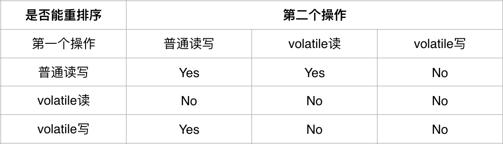

# Java多线程四
## volatile
### volatile在Java语言规范中定义
Java编程语言允许线程访问共享变量，为确保共享变量能被准确和一致地更新，线程应该确保通过排它锁单独获得这个变量。
### 术语
__内存屏障__ 是一种处理器指令，用于实现对内存操作的顺序限制。  
__缓冲行__ 缓存中可以分配的最小存储单位.处理器填写缓冲线时会加载整个缓存线,需要使用多个主内存读周期。  
__原子操作__ 不可中断的一个或一系列操作。  
__缓冲行填充__ 当处理器识别到从内存中读取的操作数是可缓存的,处理器读取整个缓存行到适当的缓存(L1,L2,L3的或所有）。  
__缓存命中__ 如果进行高速缓存行填充操作的位置仍然是下次处理器访问的地址时,处理器从缓存中读取操作数，而不是从内存读取。  
__写命中__ 当处理器将操作数写回到一个内存缓存的区域时，它首先会检查这个缓存的内存地址是否在缓存行中，如果存在一个有效的缓存行，则处理器将这个操作数写回到缓存，而不是写回到内存，这个操作被称为写命中。  
__写缺失__ 一个有效的缓存行被写入到不存在的内存区域。
### volatile作用
1. 可见性  
  有volatile变量修饰的共享变量进行写操作时会多出一行代码——Lock指令。Lock前缀的指令在多核处理器下会发生两件事情。  
  1. 将当前处理器缓存行的数据写回到系统内存。
  2. 这个写回内存的操作会使在其他CPU里缓存了该内存地址的数据无效。
2. 原子性  
  对任意单个volatile变量的读/写具有原子性，但类似于volatile++这种负荷操作不具有原则性。
3. 有序性
  volatile字段有以下重排序规则
  
  为了实现以上效果，有以下保守策略的JMM内存屏障插入策略。
  * 在每个volatile写操作的前面插入一个StoreStore屏障。
  * 在每个volatile写操作的后面插入一个StoreLoad屏障。
  * 在每个volatile读操作的后面插入一个LoadLoad屏障。
  * 在每个volatile读操作的后面，插入一个LoadStore屏障。

  StoreStore屏障，禁止上面的普通写和下面的volatile写重排序。
  StareLoad屏障，防止上面的volatile写与下面可能有的volatile读/写重排序。  
  LoadLoad屏障，禁止下面所有的普通读操作和上面的volatile读重排序。
  LoadStore屏障，禁止下面所有的普通写操作和上面的volatile读重排序。
