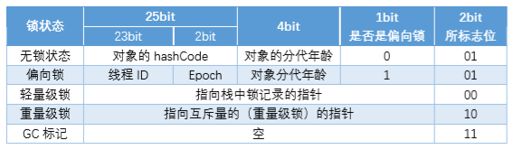

# Java多线程五
## synchronized
## synchronized的效果
当一个线程访问同步代码块的时候，会满足一下条件：
  1. 同步代码块以前的代码已经被执行完。
  2. 同步代码块以后的代码，在同步代码块执行结束之前不会被执行。
  3. 当前没有其他线程占有锁资源  

synchronized本身不能保证原子性，可见性，以及全部有序性，但可以通过阻塞保证原子性和有序性，支援可见性需要和volatile配合使用
## synchronized的优化
1. 在Java 1.5以前是重锁。
2. 在Java 1.6以后,synchronized做了大量优化：
  1. **在无锁定状态下是偏向锁。** 此时锁会指定一个经常访问它的线程,这个线程访问这个锁时,不需要判断锁的状态。
  2. **在有锁状态下是轻量级锁。** 当有线程要访问这个锁时，需要判断这个线程的状态。如果这个锁被占用,线程进行自旋，等待锁被释放。
  3. **在轻量级锁状态下，自旋满10次变成重量级锁。** 此时等待所释放的线程进入阻塞状态，等待锁释放时唤醒。

## synchronized实现原理
synchronized用的锁是存在Java对象头里的。对于成员方法，这个对象是当前的对象；对于静态方法，这个方法是类对象；对于同步代码块，这个对象实在代码中声明的对象；

当有线程访问同步代码或退出时，会去查看并改变锁对象的Java头。即JVM中的monitorenter和monitorexit指令。

## 优化
synchronized本身对性能有一些消耗，所以应当注意：
  1. 尽量避免用锁，对于本身不需要考虑线程安全的代码，不需要添加锁强制其同步；
  2. 选用合适的对象作为锁（避免不相关代码竞争同一个锁）；
  3. 锁定的代码区域尽可能的小，避免在不需要同步的地方阻塞
