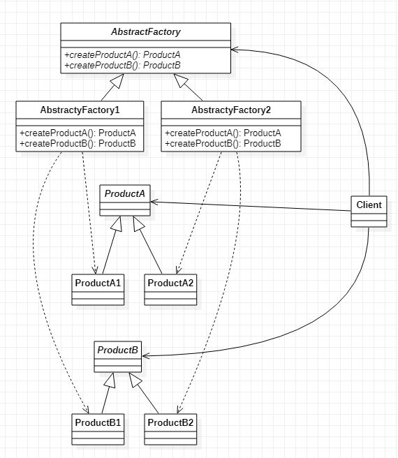

# Abstract Factory 抽象工厂模式
[设计原则学习笔记](https://www.jianshu.com/p/f7f79adad32b)  
[设计模式学习笔记](https://www.jianshu.com/p/08bf9381697c)  
## 作用
1. 管理多个系列的产品之间的关系（非必要）
2. 兼具工厂方法的作用  

对于作用1：假如我们有很多上衣和裤子（裙子），白衣服可以搭配白裤子，红衣服不能搭配绿裤子等有很多关联规则，这时候我们可以把这些关联规则放在抽象工厂中来做。抽象工厂模式不仅为产品扩展提供了方便，还给关联关系的扩展提供了方便。

## 类图


## Java实现
```JAVA
// 产品A以及其子类
public abstract class ProductA {
    public abstract void printProductName();
}
public class ProductA1 extends ProductA {
    @Override
    public void printProductName() {
        System.out.println("A1");
    }
}
public class ProductA2 extends ProductA {
    @Override
    public void printProductName() {
        System.out.println("A2");
    }
}

// 产品B以及其子类
public abstract class ProductB {
    public abstract void printProductName();
}
public class ProductB1 extends ProductB {
    @Override
    public void printProductName() {
        System.out.println("B1");
    }
}
public class ProductB2 extends ProductB {
    @Override
    public void printProductName() {
        System.out.println("B2");
    }
}

// 抽象工厂类，提供两个方法一个生产A产品一个生产B产品
public abstract class AbstractFactory {
    public abstract ProductA createProductA();
    public abstract ProductB createProductB();
}

// 抽象工厂的具体实现，生产A1和B1产品
public class AbstractFactory1 extends AbstractFactory {
    @Override
    public ProductA createProductA() {
        return new ProductA1();
    }

    @Override
    public ProductB createProductB() {
        return new ProductB1();
    }
}

// 抽象工厂的具体实现，生产A2和B2产品
public class AbstractFactory2 extends AbstractFactory {
    @Override
    public ProductA createProductA() {
        return new ProductA2();
    }

    @Override
    public ProductB createProductB() {
        return new ProductB2();
    }
}

// 客户端
public class Client {
    public static void main(String[] args) {
        AbstractFactory abstractFactory = new AbstractFactory1();
        ProductA productA = abstractFactory.createProductA();
        ProductB productB = abstractFactory.createProductB();
        productA.printProductName();
        productB.printProductName();
    }
}

```
如上面代码，我们给原本不相关的A1和B1建立了一种联系
