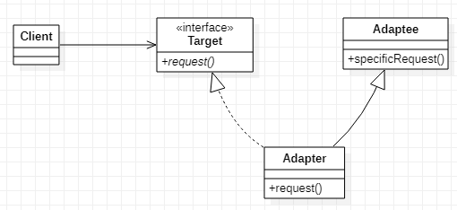
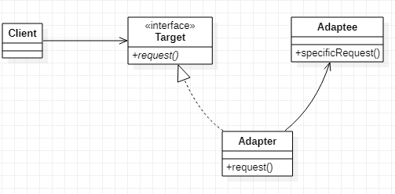

# Adapter 适配器模式
## 作用
将原本不匹配的接口转化成匹配的接口
## 类图
类适配器
  

对象适配器  


另有接口适配器，但可以认为是类适配器的一种，故在这里不做详述。
## Java实现
```Java
// 被适配对象
public class Adaptee {
    public void specificRequest() {
    }
}

// 目标接口
public interface Target {
    void request();
}


// 类适配器
public class ClassAdapter extends Adaptee implements Target {
    @Override
    public void request() {
        specificRequest();
    }
}

// 对象适配器
public class ObjectAdapter implements Target {
    private Adaptee adaptee;

    public void setAdaptee(Adaptee adaptee) {
        this.adaptee = adaptee;
    }

    @Override
    public void request() {
        if (adaptee != null) {
            adaptee.specificRequest();
        }
    }
}

// 客户端实现
public class Client {
    public static void main(String[] args) {
        // 类适配器
        Target classAdapter = new ClassAdapter();
        classAdapter.request();
        // 对象适配器
        ObjectAdapter objectAdapter = new ObjectAdapter(new Adaptee());
        objectAdapter.request();
    }
}
```
另有接口适配器，是给原有的抽象接口添加默认实现，这样在实现的时候，就不必强制实现所有接口了。
