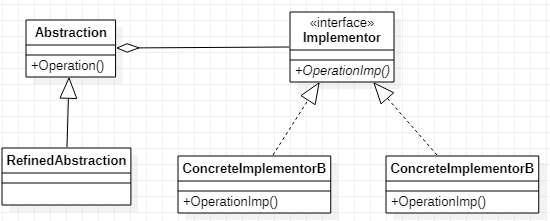

# Bridge 桥接模式
[设计原则学习笔记](https://www.jianshu.com/p/f7f79adad32b)  
[设计模式学习笔记](https://www.jianshu.com/p/08bf9381697c)  
## 作用
以持有的方式实现接口，避免继承太多导致扩展性变差，同时实现代码的复用。  
Java是单继承的，所有如果有多个接口要实现的话大多接口需要用接口（此接口非彼接口）实现，倒置代码不能复用，扩展一个接口的实现需要把其他接口的实现再写一遍。桥接模式很好的解决了这个问题
## 类图
  
Abstrction#Operation调用了Implementor#OperationImp,达到了代码复用的目的。无论是Abstration还是Implementor想扩展一个实现，都不需要重写对方的方法
## Java实现
```Java
public interface Implementor {
    void OperationImpl();
}
public class ConcreteImplementor implements Implementor {
    @Override
    public void OperationImpl() {
        //todo do something
    }
}
public abstract class Abstraction {
    public void Operation() {
        Implementor implementor = new ConcreteImplementor();
        implementor.OperationImpl();
    }
}
public class RefinedAbstraction extends Abstraction {
}
```
在Java中由于继承的侵入性太高，所有有时候即使完美的符合is-a的关系也不实用继承而是实用其他方法实现，桥接模式就是一种解决方案。
