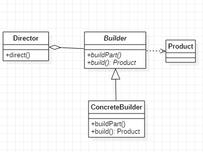

# Builder 建造者模式
## 作用
将一个类的实例化过程和这个类本身解耦。  
假设一个对象是十几个属性，给每个属性搞一个set方法本身成本很高，假设我们不允许其反复设置属性,set方法更不合适。如果在构造函数初始化这些属性（假设有缺省值），由于有相同类型的属性，所以不方便做重载，而且不同属性的组合更令人头大，如果在一个构造方法中传入全部全部属性，显然也不是一个好的设计。这时通过Builder模式可以很好的解决这些问题。
## 类图
  
Builder 实现每一步如何建造产品  
Director 用来规划要按什么顺序实现哪些步骤
## Java实现
```Java
// 产品类
public class Product {
    public String getName() {
        return name;
    }
    public void setName(String name) {
        this.name = name;
    }
    private String name;
}

// Builder及其实现
public abstract class Builder {
    protected String name;

    public abstract void buildPart();
    public abstract Product build();
}

public class ConcreteBuilder extends Builder {
    public Product build(){
        Product result = new Product();
        result.setName(name);
        return result;
    }

    @Override
    public void buildPart() {
        this.name = "Product";
    }
}

// Director类
public class Director {
    private Builder builder;
    public Director(Builder builder) {
        this.builder = builder;
    }
    public void direct() {
        builder.buildPart();
    }
}

// 客户端
public class Client {
    public static void main(String[] args) {
        Builder builder = new ConcreteBuilder();
        Director director = new Director(builder);
        director.direct();
        Product product = builder.build();
        System.out.println(product.getName());
    }
}
```
其中Builder类经常被写作产品类的静态内部类，Director类经常被省略，其逻辑写入到了客户端。
