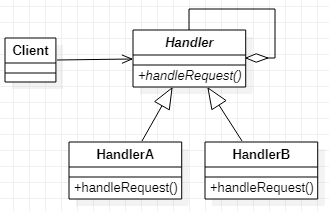

# Chan of Responsibility
## 作用
将请求以其职责拆成，并以链的结构组合，使请求在链中传递并且可以在链中拦截请求。
## 类图

## Java实现
```Java
//定义handler
public abstract class Handler {
    protected Handler handler;
    public abstract void handleRequest();
}
public class HandlerA extends Handler {
    public HandlerA() {
        handler = new HandlerB();
    }

    @Override
    public void handleRequest() {
        handler.handleRequest();
    }
}
public class HandlerB extends Handler{
    @Override
    public void handleRequest() {

    }
}
//客户端调用责任链
public class Client {
    public static void main(String[] args) {
        Handler handler = new HandlerA();
        handler.handleRequest();
    }
}
```
