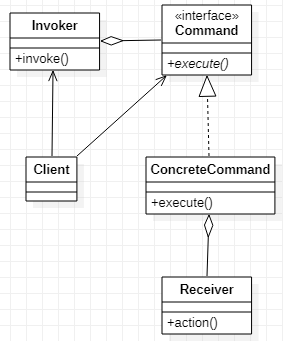

# Command 命令模式
[设计原则学习笔记](https://www.jianshu.com/p/f7f79adad32b)  
[设计模式学习笔记](https://www.jianshu.com/p/08bf9381697c)  
## 作用
将动作的请求和动作的表现解耦
## 类图
  
我这里与大部分的类图不同，我认为Reciever本身接口不确定，所以ConcreteCommand本身与Reciever内聚,所以不必要与Client耦合，而Command本身有很多，客户端需要指定Invoker持有那个Command，所以客户端与Command的耦合是避免不了的
## Java实现
```Java
//定义Reciever
public class Receiver {
    public void action() {}
}
//命令接口
public interface Command {
    void execute();
}
public class ConcreteCommand implements Command {
    @Override
    public void execute() {
        Reciever reciever = new Reciever();
        reciever.action();
    }
}
//Invoker执行Command对象的方法
public class Invoker {
    private Command command;
    public Invoker(Command command) {
        this.command = command;
    }
    public void invoke() {
        command.execute();
    }
}
//客户端
public class Client {
    public static void main(String[] args) {
        Command command = new ConcreteCommand();
        Invoker invoker = new Invoker(command);
        invoker.invoke();
    }
}
```
## Android源码中的应用
* prermClick & View.OnClickListener
* Looper & Message
