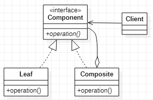

# Composite 组合模式
[设计原则学习笔记](https://www.jianshu.com/p/f7f79adad32b)  
[设计模式学习笔记](https://www.jianshu.com/p/08bf9381697c)  
## 作用
把一系列的类组合起来，作为这个系列下的一个类。  
组合模式要求整体和节点类有相同的操作。而组合模式的作用就是利用节点类达到管理和复用节点类的目的。
## 类图

## Java实现
```Java
// 定义一套接口
public interface Component {
    void operation();
}
// 定义若干叶子节点类
public class Leaf implements Component {
    @Override
    public void operation() {

    }
}
// 定义组合类
// 组合类持有若干Component类，组合类的操作等于子节点操作的和
public class Composite implements Component{
    private Component[] components = new Component[]{new Leaf(), new Leaf()};

    @Override
    public void operation() {
        for (Component component : components) {
            component.operation();
        }
    }
}
// 客户端可以无差别的使组合类或叶子节点类
public class Composite implements Component{
    private Component[] components = new Component[]{new Leaf(), new Leaf()};

    @Override
    public void operation() {
        for (Component component : components) {
            component.operation();
        }
    }
}
```
