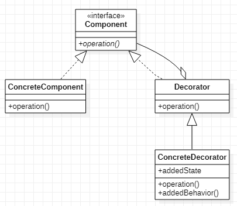

# Decorator 装饰模式
## 作用
动态的给一系列类添加新的属性以及操作。  
装饰模式和桥接模式有点像，桥接模式是将一系列类的属性和操作提取出来。两者都是提供了对扩展的开放性。
## 类图

## Java实现
```Java
// 定义一个接口
public interface Component {
    void operation();
}
// 被修饰的类
public class ConcreteComponent implements Component {
    @Override
    public void operation() {
        //todo do something.
    }
}
//抽象的以及具体的装饰类
public abstract class Decorator implements Component{
    Component component;

    public Decorator(Component component) {
        this.component = component;
    }

    @Override
    public void operation() {
        component.operation();
    }
}
public class ConcreteDecorator extends Decorator {
    public ConcreteDecorator(Component component) {
        super(component);
    }

    public void addOperation() {
        //todo do something.
    }
}
```
装饰类本质也是一个Component实现，单不能单独使用，需要配合被修饰的类实用，其接口提供的方法主要还是由被修饰的类来实现。
