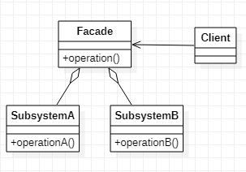

# Facade 外观模式
## 作用
管理，封装若干子系统，使其作为一个整体系统对外提供操作。
## 类图
  
组合模式和外观模式的区别在于，组合模式组合的是继承于同一个接口（抽象类）的类，执行的操作接口是相同的操作接口。而外观模式执行的是不同的接口，而且也不要求有相同的接口或父类。
## Java实现
```Java
// 定义子系统
public class SubsystemA {
    public void operationA() {}
}
public class SubsystemB {
    public void operationB() {}
}

// 定义外观类
public class Facade {
    private SubsystemA subsystemA = new SubsystemA();
    private SubsystemB subsystemB = new SubsystemB();

    public void operation() {
        subsystemA.operationA();
        subsystemB.operationB();;
    }
}

// 客户端不直接与子系统通信
public class Client {
    public static void main(String[] args) {
        Facade facade = new Facade();
        facade.operation();
    }
}
```
