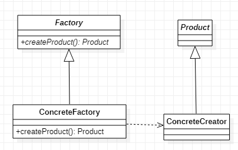

# Factory Method 工厂方法模式
## 作用
将本来需要耦合的两种类，通过工厂间接联系，避免直接耦合

比如：有n个A的子类A1,A2……和m个B的子类B1,B2……每个A类都会依赖每一个B的子类，这是。这时，所有A类和所有B的依赖关系一个有m*n条线，扩展一个A类的代价是要添加m个B类，扩展一个B类是要修改n个A类。如果所有A类都通过同一个1个工厂类那么，依赖关系为m+n条线，扩展一个A类的代价是添加1个工厂，扩展一个B类是修改一个工厂（简单工厂）
## 类图
  
如图客户端通过持有工厂类的实现，避免了直接持有具体的产品。根据工厂类的策略，间接的生成不同的产品类。
## Java实现
```JAVA
public abstract class Product {
    public abstract String getProductName();
}

public class ProductA extends Product {
    @Override
    public String getProductName() {
        return "产品A";
    }
}

public abstract class Factory {
    public abstract Product createProduct();
}

public class ConcreteFactory extends Factory {
    @Override
    public Product createProduct() {
        return new ProductA();
    }
}

public class Client {
    public static void main(String[] args) {
        Factory factory = new ConcreteFactory();
        Product product = factory.createProduct();
        System.out.println(product.getProductName());
    }
}
```
在上面的代码中客户端避免了与具体的产品直接依赖，具体使用哪个产品的逻辑由具体的Factory来处理。未来扩展出新产品也由Factory来扩展而避免了客户端的修改。
