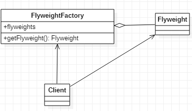

# Flyweight 享元模式
[设计原则学习笔记](https://www.jianshu.com/p/f7f79adad32b)  
[设计模式学习笔记](https://www.jianshu.com/p/08bf9381697c)  
## 作用
提供可复用的对象。
## 类图
  
享元模式一般包含一个工厂，工厂中含有一个享元的集合。当通过享元工厂获取享元时，享元工厂先去集合中去查看是否有可以复用的对象，如果有则复用，如果没有则创建。
## Java实现
```Java
// 享元
public class Flyweight {
}
// 享元工厂
public class FlyweightFactory {
    private List<Flyweight> list = new LinkedList<>();
    public Flyweight getFlyweight() {
        if (list.isEmpty()) {
            return new Flyweight();
        }
        return list.remove(0);
    }
    public void addFlyweight(Flyweight flyweight) {
        list.add(flyweight);
    }
}
// 客户端，第二次和第一次是同一个享元对象
public class Client {
    public static void main(String[] args) {
        FlyweightFactory flyweightFactory = new FlyweightFactory();
        Flyweight flyweight = flyweightFactory.getFlyweight();
        flyweightFactory.addFlyweight(flyweight);
        flyweightFactory.getFlyweight();
    }
}
```
享元模式要求区分享元的内部状态和外部状态，外部状态要求正确重置，否则会携带上次使用的状态，使用时会出现bug
## Android源码中的应用
* Resource获取资源
* Glide缓存池
