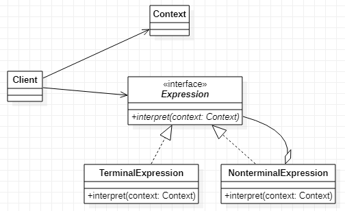

# Interpreter 备忘录模式
[设计原则学习笔记](https://www.jianshu.com/p/f7f79adad32b)  
[设计模式学习笔记](https://www.jianshu.com/p/08bf9381697c)  
## 作用
将表达式转化为操作，并且将其拆成最小的单元
## 类图

## Java实现
``` Java
// 构建表达式类
public class Context {
    public char[] chars;
}
// 定义Expression接口
public interface Expression {
    int interpret(Context context);
}
// 定义TerminalExpression对Context的最小单元进行解释
public class TerminalExpression implements Expression {
    @Override
    public int interpret(Context context) {
        if (context.chars[0] == '$') {
            return 1;
        }
        return 0;
    }
}
// 定义NonterminalExpression用于拆分表达式
public class NonterminalExpression implements Expression {
    @Override
    public int interpret(Context context) {
        if (context.chars.length == 1) {
            return new TerminalExpression().interpret(context);
        }

        Context context1 = new Context();
        context1.chars = new char[] {context.chars[0]};

        Context context2 = new Context();
        int length = context.chars.length - 1;
        context2.chars = new char[length];
        System.arraycopy(context.chars, 1, context2.chars, 0, length);

        return new TerminalExpression().interpret(context1) + new NonterminalExpression().interpret(context2);
    }
}
// 客户端
public class Client {
    public static final void main(String[] args) {
        Context context = new Context();
        context.chars = "@#$%^&%$#W@#$%^".toCharArray();
        System.out.println(new NonterminalExpression().interpret(context));
    }
}
```
上面的代码对表达式（字符数组）进行解释（统计里面的字符'$'的数量）
## Android源码中的应用
* 正则表达式
