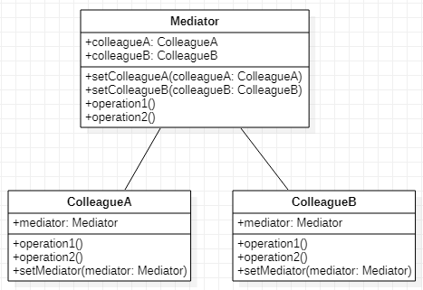

# Mediator 中介者模式
## 作用
为不同对象提供一个中心化的通信方式，从而避免直接耦合。
## 类图
  
## Java实现
```Java
// 定义ColleagueA
public class ColleagueA {
    private Mediator mediator;
    public ColleagueA(Mediator mediator) {
        this.mediator = mediator;
        mediator.setColleagueA(this);
    }

    public void operation1() {
        mediator.operation1();
    }
    public void operation2 () {

    }
}
// 定义ColleagueB
public class ColleagueB {
    private Mediator mediator;
    public ColleagueB(Mediator mediator) {
        this.mediator = mediator;
        mediator.setColleagueB(this);
    }

    public void operation1() {
    }

    public void operation2() {
        mediator.operation2();
    }
}
// 定义Mediator协同ColleagueA和ColleagueB
public class Mediator {
    private ColleagueA colleagueA;
    private ColleagueB colleagueB;

    public void setColleagueA(ColleagueA colleagueA) {
        this.colleagueA = colleagueA;
    }

    public void setColleagueB(ColleagueB colleagueB) {
        this.colleagueB = colleagueB;
    }

    public void operation1() {
        colleagueB.operation1();
    }

    public void operation2() {
        colleagueA.operation2();
    }
}

// 客户端创建Mediator,ColleagueA,ColleagueB并绑定
public class Client {
    public static void main(String[] args) {
        Mediator mediator = new Mediator();
        ColleagueA colleagueA = new ColleagueA(mediator);
        ColleagueB colleagueB = new ColleagueB(mediator);
        colleagueA.operation1();
        colleagueB.operation2();
    }
}
```
通过中介者ColleageA和ColleageB虽然没有直接耦合，但可以协同工作。

中介者模式和外观模式很相似，两者区别在于，外观模式是总系统对子系统的控制。而中介者模式是协同不同系统之间的通信。外观模式一般是总系统向子系统的单向控制。而中介者模式一般是双向的通信。
