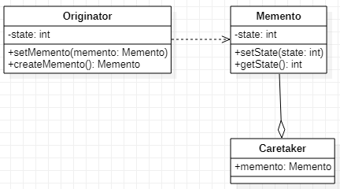

# Memento 备忘录模式
[设计原则学习笔记](https://www.jianshu.com/p/f7f79adad32b)  
[设计模式学习笔记](https://www.jianshu.com/p/08bf9381697c)  
## 作用
使对象可以保存并恢复到某一状态。
## 类图

## Java实现
```Java
// 定义原发器
public class Originator {
    private int state;
    public Memento createMemento() {
        return new Memento(state);
    }
    public void setMemento(Memento memento) {
        state = memento.getState();
    }
    public void setState(int state) {
        this.state = state;
    }
}
// 定义备忘录，备忘录持有原发器需要保存的属性
public class Memento {
    private int state;
    public int getState() {
        return state;
    }
    public Memento(int state) {
        this.state = state;
    }
}
// 定义Caretaker保存Memento
public class CareTaker {
    private Memento memento;
    public void saveMemento(Originator originator) {
        memento = originator.createMemento();
    }
    public Memento getMemento() {
        return memento;
    }
}
// 客户端
public class Client {
    public static void main(String[] args) {
        Originator originator = new Originator();
        originator.setState(1);
        CareTaker careTaker = new CareTaker();
        careTaker.saveMemento(originator);
        originator.setState(2);
        originator.setMemento(careTaker.getMemento());
    }
}
```
## Android源码中的应用
* onSaveInstanceState & onRestoreInstanceState
