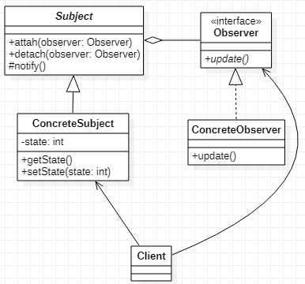

# Observer 观察者模式
## 作用
使数据结构的变换可以从数据结构主动通知到观察者处。同时方便观察者和被观察者扩展。
## 类图
  
## Java实现
```Java
// 定义观察者接口
public interface Observer {
    void update();
}
// 实现观察者接口
public class ConcreteObserver implements Observer {
    @Override
    public void update() {

    }
}
// 定义被观察者接口
public abstract class Subject {
    List<Observer> list = new LinkedList<>();
    public void attach(Observer observer) {
        list.add(observer);
    }
    public void detach(Observer observer) {
        list.remove(observer);
    }
    protected void notifyObserver() {
        for (Observer observer : list) {
            observer.update();
        }
    }
}
// 实现被观察者，在数据变化时调用notify方法通知到观察者
public class ConcreteSubject extends Subject {
    private int state;

    public int getState() {
        return state;
    }

    public void setState(int state) {
        this.state = state;
        notifyObserver();
    }
}
// 客户端绑定观察者与被观察者
public class Client {
    public static void main(String[] args) {
        ConcreteSubject subject = new ConcreteSubject();
        Observer observer = new ConcreteObserver();
        subject.attach(observer);
        subject.setState(1);
        subject.detach(observer);
    }
}
```
观察者模式分为推模型和拉模型，推模型在通知的时候主动将数据推给观察者，拉模型则只通知观察者发生了变换，具体数据需要单独再获取。
