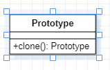

# Prototype 原型模式
[设计原则学习笔记](https://www.jianshu.com/p/f7f79adad32b)  
[设计模式学习笔记](https://www.jianshu.com/p/08bf9381697c)  
## 作用
复制一个一模一样的对象。  
对象有部分组成，属性和方法，在属性相同的情况下，方法应该是幂等的。有时我们为了比如说保存状态等行为。需要一个一模一样的对象，而不影响原对象。传统方式需要外界手动复制对象的所有属性，克隆模式就是为了避免这种繁琐的操作。
## 类图
  
原型模式通过实现clone接口返回一个Prototype对象，根据clone接口的不同实现。原型模式又分为深拷贝，浅拷贝。  
假设，Prototype中有一个对象类型的属性a,克隆后的和原来的Prototype指向同一个地址,则这种拷贝方式为浅拷贝，如果指向不同的地址则认为是深拷贝。
## Java实现
```Java
// 浅拷贝，理由Object的clone方法
// 需要实现Cloneable接口
public class Prototype implements Cloneable{
    public Prototype clonePrototybe() {
        Prototype result = null;
        try {
            result = (Prototype) super.clone();
        } catch (Exception e) {
            e.printStackTrace();
        }
        return result;
    }
}

// 深拷贝，通过序列化反序列化的方式
// 要求属性要么继承序列化接口Serializable或者Android的Parcelable要么用transient修饰（不会被拷贝）
public class DeepCopy implements Serializable{
    public DeepCopy deepCopy() {
        DeepCopy result = null;
        ByteArrayOutputStream byteArrayOutputStream = null;
        ObjectOutputStream objectOutputStream = null;
        ByteArrayInputStream byteArrayInputStream = null;
        ObjectInputStream objectInputStream = null;
        try {
            byteArrayOutputStream = new ByteArrayOutputStream();
            objectOutputStream = new ObjectOutputStream(byteArrayOutputStream);
            objectOutputStream.writeObject(this);

            byteArrayInputStream = new ByteArrayInputStream(byteArrayOutputStream.toByteArray());
            objectInputStream = new ObjectInputStream(byteArrayInputStream);
            result = (DeepCopy) objectInputStream.readObject();
        } catch (Exception e) {
            e.printStackTrace();
        } finally {
            try {
                byteArrayInputStream.close();
                objectInputStream.close();
                byteArrayOutputStream.close();
                objectOutputStream.close();
            } catch (IOException e) {
                e.printStackTrace();
            }
        }
        return result;
    }
}
```
另外有一些克隆的方式，一般没有这两种方便，所有这里不做讨论。
