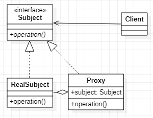

# Proxy 代理模式
## 作用
为对象提供增强作用
## 类图
  
图为静态代理。另有动态代理模式，由于类图不具有代表性，故不再这里展示
## Java实现
```Java
// 被代理接口
public interface Subject {
    void operation();
}
// 被代理对象
public class RealSubject implements Subject {
    @Override
    public void operation() {
    }
}

// 静态代理
// 静态代理对象
public class StaticProxy implements Subject {
    private Subject subject;
    public StaticProxy(Subject subject) {
        this.subject = subject;
    }
    @Override
    public void operation() {
        // todo do something
        subject.operation();
        // todo do something
    }
}
// 动态代理
// 动态代理借助jdk
public class DynamicProxy implements InvocationHandler {
    private RealSubject subject;
    public Subject proxy(RealSubject subject) {
        this.subject = subject;
        return (RealSubject) Proxy.newProxyInstance(Subject.class.getClassLoader(), Subject.class.getInterfaces(), this);
    }
    @Override
    public Object invoke(Object proxy, Method method, Object[] args) throws Throwable {
        // todo do something
        Object result = method.invoke(subject, args);
        // todo do something
        return result;
    }
}
// 客户端
public class Client {
    public static void main(String[] args) {
        // 静态代理必须向上转型
        Subject staticProxy = new StaticProxy(new RealSubject());
        staticProxy.operation();

        // 动态代理不必向上转型
        RealSubject dynamicProxy = new DynamicProxy().proxy(new RealSubject());
        dynamicProxy.operation();
    }
}
```
另有Cglib方法实现动态代理，不过需要依赖第三方库，故在此不做详细介绍。

代理模式装饰模式都有增强类行为的作用，尤其是静态代理模式。两者不同的是装饰器模式更偏向于对功能的动态添加，完善。而代理模式更侧重于对功能的控制。
