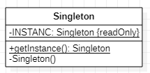

# Singleton 单例模式
[设计原则学习笔记](https://www.jianshu.com/p/f7f79adad32b)  
[设计模式学习笔记](https://www.jianshu.com/p/08bf9381697c)  
## 作用
创建全局唯一的实例，提供给全局任意的地方使用。
## 类图
  
一般单例模式有以下几部分组成：  
一个静态的私有的只会赋值一次的INSTANCE对象，用来确保全局获取的都是这个Instance对象；  
一个私有化的构造方法，确保不会有其他途径可以实例化这个类；  
一个静态的共有的方法，对外提供单例对象。
## JAVA实现
单例的实现方式有多重，一般从可读性，性能，和安全性上考虑，比较推荐的是__静态内部类方法__和__双重检查方法__
``` JAVA
// 静态内部类方法
public class Singleton {
    private static class CLASSHOLDER {
        private static final Singleton INSTANCE = new Singleton();
    }

    public static Singleton getInstance() {
        return CLASSHOLDER.INSTANCE;
    }

    private Singleton() {
    }
}
```
静态内部类利用了ClassLoader本身是线程安全的原理确保了单例线程安全；

``` JAVA
// 双重检查方法
public class Singleton {
  private static volatile Singleton sInstance ;

  public static Singleton getInstance() {
      if (sInstance == null) {
          synchronized (Singleton.class) {
              if (sInstance == null) {
                  sInstance = new Singleton();
              }
          }
      }
      return sInstance;
  }

  private Singleton() {
  }
}
```
双重检查涉及到的知识点比较多：  
1. 第一个判空是为了提高性能，去掉以后就成了饿汉式的一种；  
2. volatile关键字是为了避免指令重排带来的bug,在指令重排的情况下。在线程一可能已经给sInstance字段赋值，但是指向的是一个空地址，此时线程二可能误判Singleton不为空返回sIntance造成空指针；
3. synchronized锁住的是Singleton.class对象，这个对象本省是全局唯一的，所以不同线程进入代码块要判断是否可以获取Singleton.class对象的锁。

## Android源码中的应用

* LayoutInflater
* Glide
* SystemServiceRegistry
