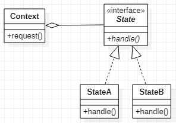

# State 状态模式
## 作用
将一个类在不同状态下的操作组合起来，成为一个类。方便不同状态下的操作切换和扩展。
## 类图

## Java实现
```Java
//定义状态
public interface State {
    void handle();
}
public class StateA implements State {
    @Override
    public void handle() {
        //todo do something A
    }
}
public class StateB implements State {
    @Override
    public void handle() {
        //todo do something B
    }
}
//定义Context
public class Context {
    private State state = new StateA();
    public void request() {
        state.handle();
    }
    public void setState(State state) {
        this.state = state;
    }
}
//客户端在不同状态下有不同行为
public class Client {
    public static void main(String[] args) {
        Context context = new Context();
        context.request();
        context.setState(new StateB());
        context.request();
    }
}
```
