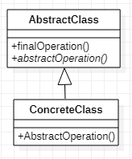

# Template Method 模板方法模式
[设计原则学习笔记](https://www.jianshu.com/p/f7f79adad32b)  
[设计模式学习笔记](https://www.jianshu.com/p/08bf9381697c)  
## 作用
将可变的和不可变的代码分离，可变的代码由子类实现，不可变代码由父类实现，以达到复用的效果和方便扩展的作用。
## 类图

## Java实现
```Java
// 抽象方法
public abstract class AbstractClass {
    public final void finalMethod() {}
    public abstract void abstractMethod();
}
// 具体方法
public class ConcreteClass extends AbstractClass {
    @Override
    public void abstractMethod() {
    }
}
```
