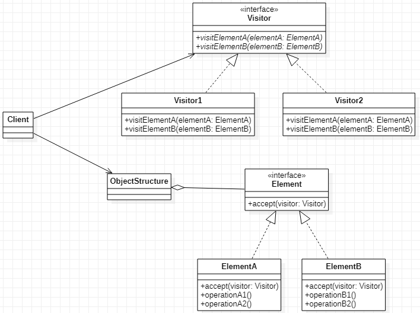

# Visitor 访问者模式
## 作用
允许不同的访问者访问以不同方式访问数据，同时尽可能给访问者和数据结构解耦，方便数据结构和访问者扩展。
## 类图

## Java实现
```Java
// 定义被访问者
public interface Element {
    void accept(Visitor visitor);
}
public class ElementA implements Element {
    @Override
    public void accept(Visitor visitor) {
        visitor.visitElementA(this);
    }
    public void operationA1() {
        // todo do something
    }
    public void operationA2() {
        // todo do something
    }
}
public class ElementB implements Element {
    @Override
    public void accept(Visitor visitor) {
        visitor.visitElementB(this);
    }
    public void operationB1() {
        // todo do something
    }
    public void operationB2() {
        // todo do something
    }
}
// 定义访问者
public interface Visitor {
    void visitElementA(ElementA elementA);
    void visitElementB(ElementB elementB);
}
public class Visitor1 implements Visitor {
    @Override
    public void visitElementA(ElementA elementA) {
        elementA.operationA1();
    }

    @Override
    public void visitElementB(ElementB elementB) {
        elementB.operationB1();
    }
}
public class Visitor2 implements Visitor {
    @Override
    public void visitElementA(ElementA elementA) {
        elementA.operationA2();
    }

    @Override
    public void visitElementB(ElementB elementB) {
        elementB.operationB2();
    }
}
// 定义一个结合，聚合数据结构
public class ObjectStructure {
    private Element[] elements = new Element[] {new ElementA(), new ElementB()};
    public Element[] getElements() {
        return elements;
    }
}
// 客户端调用访问者访问数据结构
public class Client {
    public static void main(String[] args) {
        ObjectStructure structure= new ObjectStructure();
        Element[] elements = structure.getElements();
        Visitor1 visitor1 = new Visitor1();
        for (Element element : elements) {
            element.accept(visitor1);
        }
        Visitor2 visitor2 = new Visitor2();
        for (Element element : elements) {
            element.accept(visitor2);
        }
    }
}
```
