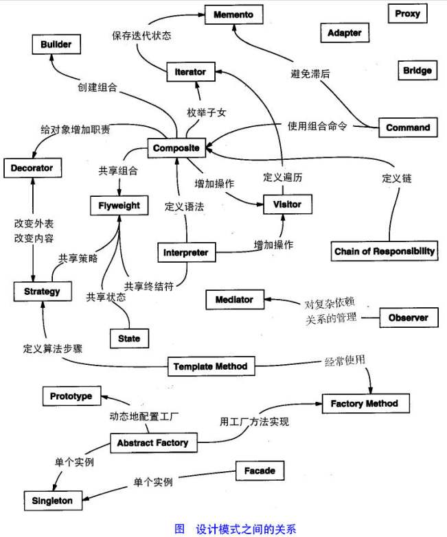

# 设计模式
设计模式是前人（四人帮）在面向对面向对象编程的过程中经验，发现好的代码，总结下来，在特定的应用场景下，方便广大程序员复用。同时设计模式也是程序员中沟通的术语，熟练掌握设计模式，有助于我们写出可阅读的代码和阅读别人的代码。  
设计模式一共被总结出23种，每种设计模式有各自的用途，不同的设计模式又有联系。

设计模式分类如下：

| 创建              | 结构            | 行为           |
| :-------------    | :------------- | :------------- |
| [Abstract Factory](https://www.jianshu.com/p/a61c5563bd8a) | [Adapter](https://www.jianshu.com/p/c516ef14408d) | [Chain of Responsibility](https://www.jianshu.com/p/583afa653193) |
| [Builder](https://www.jianshu.com/p/af0e650e7ad4) | [Bridge](https://www.jianshu.com/p/bb573a2dcdb5) | [Command](https://www.jianshu.com/p/91995d13edcd) |
| [Factory Method](https://www.jianshu.com/p/b4f6113d8afd) | [Composite](https://www.jianshu.com/p/2cb49d70cfea) | [Interpreter](https://www.jianshu.com/p/55edaaa7c945) |
| [Prototype](https://www.jianshu.com/p/1b3b677c31e0) | [Decorator](https://www.jianshu.com/p/db6bf68c084e) | [Iterator](https://www.jianshu.com/p/df4084d85bbe) |
| [Singleton](https://www.jianshu.com/p/93a262ed9521) | [Facade](https://www.jianshu.com/p/0688c455552c) | [Mediator](https://www.jianshu.com/p/e1c8d0cb9335) |
| | [Flyweight](https://www.jianshu.com/p/74b64f8d99b0) | [Memento](https://www.jianshu.com/p/2043a329fc4c) |
| | [Proxy](https://www.jianshu.com/p/90cf0967f993) | [Observer](https://www.jianshu.com/p/647abbc96dd0) |
| | | [State](https://www.jianshu.com/p/8fd91bd39ac9) |
| | | [Strategy](https://www.jianshu.com/p/1e998382a2c9) |
| | | Template Method |
| | | Visitor |
